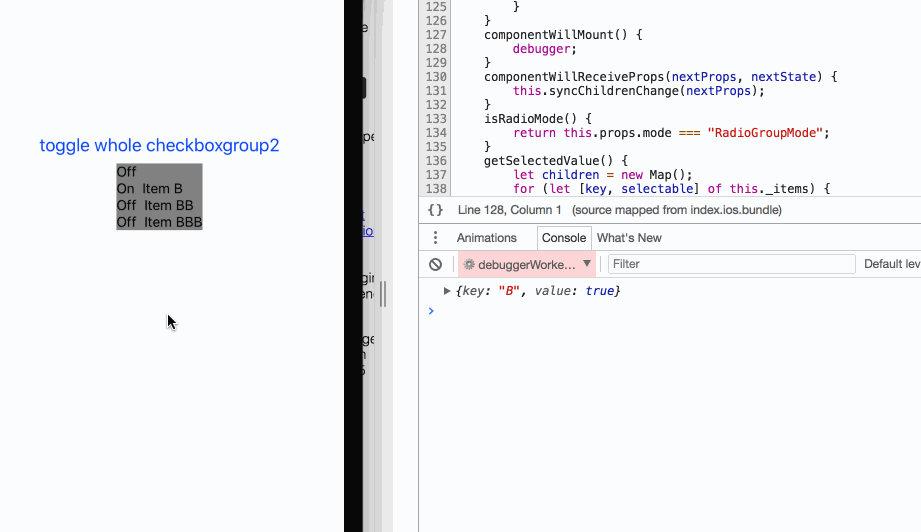
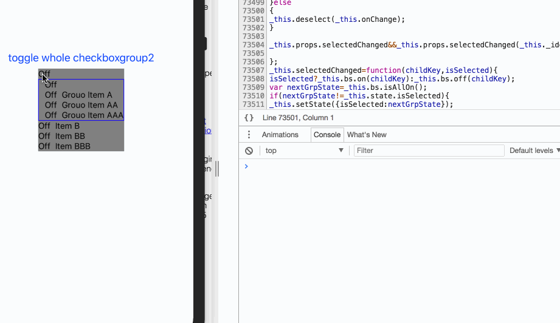
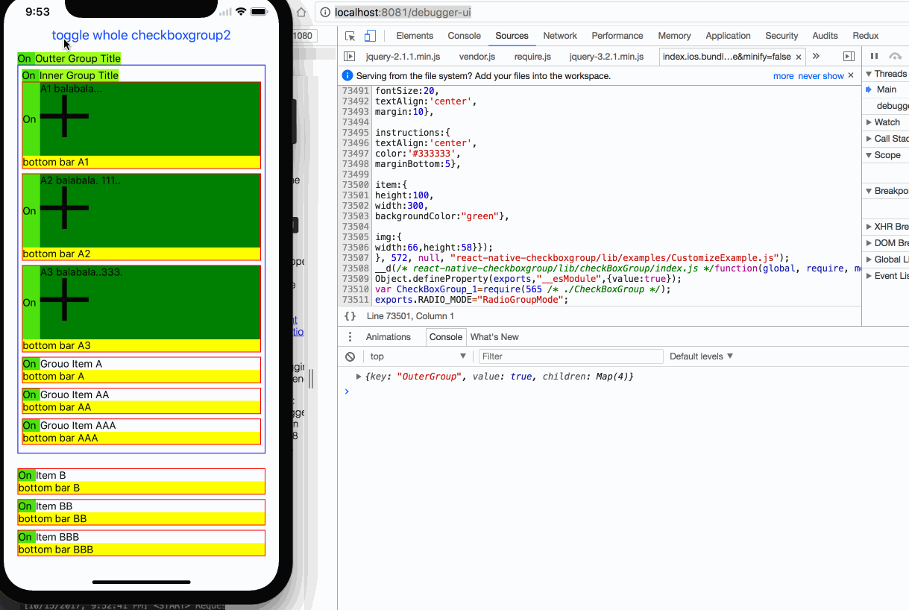
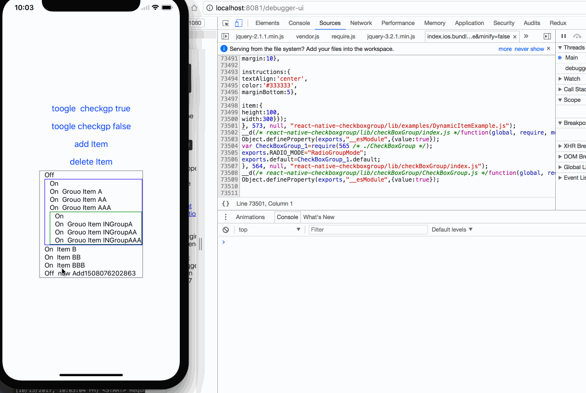
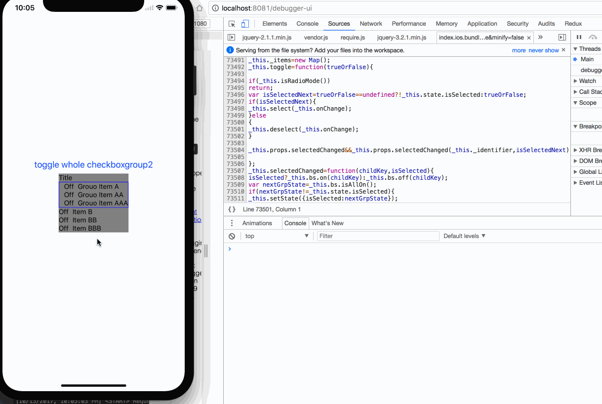

`CheckBoxGroup` is not just a checkbox, it is a Grouped checkbox
===

[中文版说明 戳这里][f]

install
---
```
npm install react-native-checkboxgroup
```

API
----
this lib only expose one default component called `CheckBoxGroup` , it treats each child as an checkbox option.
it self also has a feature to toggle all the options at a time.
the typical usage is the shopping cart like Tmall or JD.

below is the example:

```
import CheckBoxGroup from "react-native-checkboxgroup"

<CheckBoxGroup>
	<Text key="B">this is a simplest checkbox item</Text>
	<View key="CC">
		this is more complex checkbox item
	</View>
	<CustomComp key="BBB">also any custom UI can be a checkbox item</CustomComp>
</CheckBoxGroup>

```

in this example there are 3 checkbox options in one group .each option has an interactive indicator  telling whether it is selected or not .
The indicator is highly customizable, also the layout of the item is customizable by `rowTemplate`

 ```
 indicator by default is   on/off
|____________________________________
| ⬛️ |     here is the group title  |----------> title Bar is consist of the title and indicator
|___________________________________________
| ⬛️ |  this is a simplest checkbox item		|-----> option item is consist of the indicator and a child ui
| ⬛️ |  this is more complex checkbox item	|
| ⬛️ |  also any custom UI can be a checkbox item	|
|________________________________________________
| here is the group footer  |----------> pure UI element no check box available, for tips purpose
|___________________________________________

```
### CheckBoxGroup
> ***all children in CheckBoxGroup tag MUST have the `key` property  ，it reuse the `key` props of react as the item's `id`,  it tells who is selected. But there is one exception ,that is the  outermost  `CheckBoxGroup` , it use `identifier` as the `id` prop but it is optional  ***

> > the Nested `CheckBoxGroup` ***extends all the customizable props of the father `CheckBoxGroup` by default ,so it means plz do config on top level `CheckBoxGroup`   ***
> >
> > it also support radio mode ,under this mode plz don't nest `CheckBoxGroup` too deep, more then 2 depth is not predictable .


|property|signature|description|
|----|---|---|
|identifier?: string;||the id of the outermost CheckBoxGroup |
|mode?:"RadioGroupMode"||switch on the radio mode ，***the `toggle` api of `CheckBoxGroup` doesn't work of under this mode ,it makes sense, also the indicator of the group is not visible***|
|isGroupTitleBarVisiable?:boolean;||should show the title bar of the group ,`default true`|
|renderTitle?:()=>React.ReactElement<any>;||customize the title of the group |
|renderCheckBox?: (isSelected: boolean) => ReactElement<any>;||customize the indicator UI|
|rowTemplate?: (checkbox: ReactElement<any>, item: React.ReactNode,key:string) => ReactElement<any>;||customize the layout of one option item，PARAMS=> `checkbox` the customized indicator rendered by `renderCheckBox` if exist, or on/off by default ，PARAMS=>`item`：`CheckBoxGroup` the child ui (UI in `CheckBoxGroup` tag)，PARAMS=>`key`:the id of the option item|
|onChange?:(k:SelectedStatus)=>void;||the select status （include the nested childrens' status） changed by user |

|Method| Desc |
|----|---|
|getSelectedValue(isFilterFalse:boolean=true):SelectedStatus|use this to get the group status manually,`by default` it only return the selected option items,by setting `isFilterFalse` to false to get all option status no matter selected or not|
|toggle(trueOrFalse?:boolean): void;|select all or deselect all option of a group


Examples
---
|Case|Code|Gif|
|---|---|---|
|simple Exam| [SimpleExample][a]|
|Nest Group Exam |[SimpleNestExample][b]|
|Customize Group Exam| [CustomizeExample][c]|
|Add/Del option Item Dynamic Exam|[DynamicItemExample][d]|
|Radio Mode Eaxm|[RadioGroupMode][e]|


[a]:https://github.com/ShiYuanjun-Tim/react-native-checkboxGroup/blob/master/src/examples/SimpleExample.tsx
[b]:https://github.com/ShiYuanjun-Tim/react-native-checkboxGroup/blob/master/src/examples/SimpleNestExample.tsx
[c]:https://github.com/ShiYuanjun-Tim/react-native-checkboxGroup/blob/master/src/examples/CustomizeExample.tsx
[d]:https://github.com/ShiYuanjun-Tim/react-native-checkboxGroup/blob/master/src/examples/DynamicItemExample.tsx
[e]:https://github.com/ShiYuanjun-Tim/react-native-checkboxGroup/blob/master/src/examples/RadioGroupMode.tsx
[f]:https://github.com/ShiYuanjun-Tim/react-native-checkboxGroup/blob/master/docs/README_zh.md
